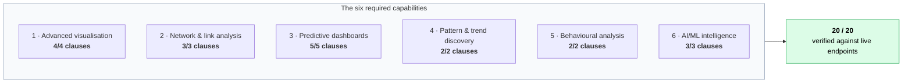
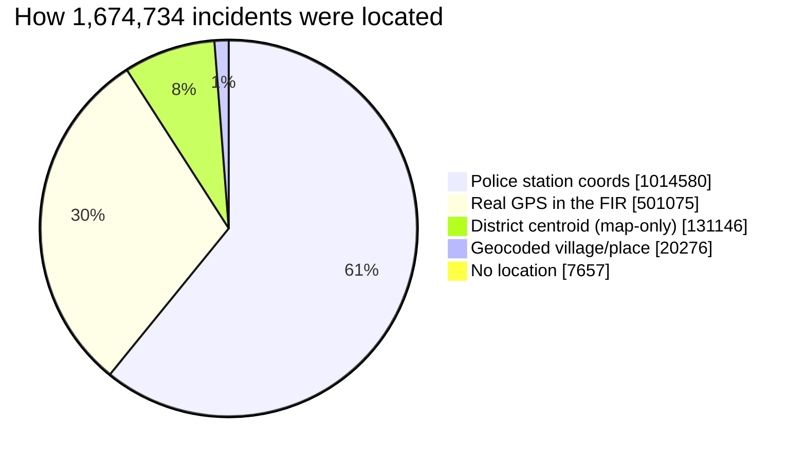
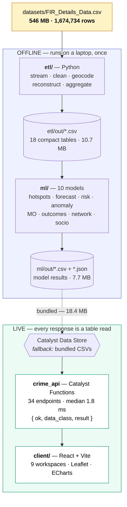
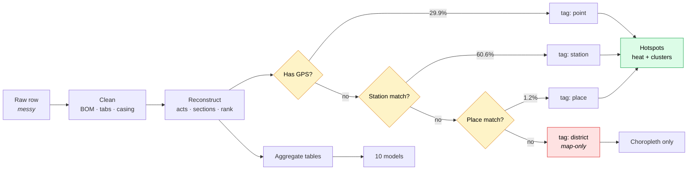
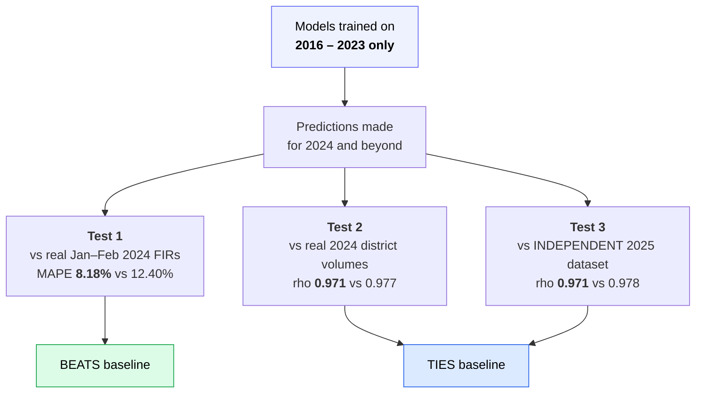

# KSP Crime Intelligence & Analytical Platform

**An AI-driven crime analytics platform for the Karnataka State Police / State Crime Records Bureau (SCRB).**
Built for the Hack2Skill Datathon 2026. Deployed on Zoho Catalyst.

It turns 1,674,734 real First Information Reports into maps you can read, forecasts you can check,
and patterns an investigating officer can actually use — while being explicit about the things this
data honestly cannot tell you.

```
1,674,734 real FIRs · 2016–2024 · 31 districts · 10 models · 9 workspaces · 61 automated tests
                    deployed end-to-end on Zoho Catalyst
```

---

## Table of contents

1. [The problem we set out to solve](#1-the-problem-we-set-out-to-solve)
2. [What the platform does](#2-what-the-platform-does)
   - [The numbers, at a glance](#2b-the-numbers-at-a-glance)
   - [Every model against its baseline](#2c-every-model-against-its-baseline)
   - [Efficiency: where the time goes](#2d-efficiency-where-the-time-goes)
3. [Quick start: running it yourself](#3-quick-start-running-it-yourself)
4. [How it all fits together](#4-how-it-all-fits-together)
5. [The data](#5-the-data)
6. [The pipeline, stage by stage](#6-the-pipeline-stage-by-stage)
7. [The models: all ten explained](#7-the-models-all-ten-explained)
8. [Does it actually work? Ground-truth validation](#8-does-it-actually-work-ground-truth-validation)
9. [The API](#9-the-api)
10. [The interface: nine workspaces](#10-the-interface-nine-workspaces)
11. [Honesty, fairness, and what we refuse to do](#11-honesty-fairness-and-what-we-refuse-to-do)
12. [Testing and quality control](#12-testing-and-quality-control)
13. [Deployment and Catalyst services](#13-deployment-and-catalyst-services)
14. [Repository layout](#14-repository-layout)
15. [Things that went wrong (and what we learned)](#15-things-that-went-wrong-and-what-we-learned)

---

## 1. The problem we set out to solve

Karnataka Police record an enormous amount of crime data. The difficulty is not collection — it is
that the data sits in silos, gets analysed in Excel, and mostly answers questions about *what already
happened*.

The challenge statement named four specific pain points:

| Pain point | What it means day-to-day |
|---|---|
| **Data silos & manual processes** | Records live in separate systems; analysis means spreadsheets |
| **No advanced analytics** | Behavioural patterns and connected networks stay invisible |
| **Information gaps** | SCRB sees fragments, not a state-wide picture |
| **Reactive, not proactive** | Without trend detection, policing responds instead of preventing |

So the goal was never "make charts." It was to move SCRB from *reporting what happened* to
*anticipating what is likely to happen next* — and to do it in a way an officer can trust.

---

## 2. What the platform does

Six capabilities were required. Here is where each one landed, verified against the running system:

| # | Capability | Status |
|---|---|---|
| 1 | **Advanced visualisation** — district maps, station drill-down, spatiotemporal hotspots, red-zone alerts | ✅ Delivered |
| 2 | **Network & link analysis** — relationship mapping, repeat-offender tracking, association detection | ✅ Delivered (person layer clearly labelled synthetic — [see §11](#11-honesty-fairness-and-what-we-refuse-to-do)) |
| 3 | **Sociological & predictive dashboards** — socio-economic correlation, risk scoring, anomaly detection | ✅ Delivered |
| 4 | **Pattern & trend discovery** — statistical spatial and temporal hotspots | ✅ Delivered |
| 5 | **Network & behavioural analysis** — organised-crime structures, recurring modus operandi | ✅ Delivered |
| 6 | **AI/ML-driven intelligence** — hidden correlations, anomalies, emerging risk prediction | ✅ Delivered |



A scripted conformance check tests all 20 individual clauses of the problem statement against live
API endpoints. Current result: **20/20 delivered** — 16 outright, 1 restricted to genuinely observed
data, 3 through a labelled synthetic demonstration plus a real supporting engine.

---

## 2b. The numbers, at a glance

Every figure below is generated from the live artifacts. Nothing here is illustrative.

### Nine years of crime, as recorded

```
2016  ███████████████████████████████░░░  227,717
2017  ██████████████████████████████████  246,839   <- peak year
2018  ██████████████████████████████░░░░  219,447
2019  ████████████████████████░░░░░░░░░░  175,486
2020  ██████████████████████░░░░░░░░░░░░  160,547   <- COVID year
2021  ████████████████████████░░░░░░░░░░  175,857
2022  ███████████████████████████░░░░░░░  195,170
2023  ████████████████████████████████░░  231,326
2024  ██████░░░░░░░░░░░░░░░░░░░░░░░░░░░░   42,345   <- PARTIAL (cut mid-March)
```

The 2020 dip is real. It is also exactly why the alert model baselines on 2021-2022 instead of the
full history: including COVID-suppressed years would make every 2023 comparison look like a spike.

### How every incident got onto the map

Only 29.9% of FIRs arrive with GPS. A four-tier resolver lifts coverage to **99.54%** — and tags
each record with *how* it was located, because that tag decides what the record is allowed to do.

```
Police station coords  █████████████████░░░░░░░░░░░  60.6%   1,014,580  -> heat + clusters
Real GPS               ████████░░░░░░░░░░░░░░░░░░░░  29.9%     501,075  -> heat + clusters
District centroid      ██░░░░░░░░░░░░░░░░░░░░░░░░░░   7.8%     131,146  -> choropleth ONLY
Geocoded place         ░░░░░░░░░░░░░░░░░░░░░░░░░░░░   1.2%      20,276  -> heat + clusters
No location            ░░░░░░░░░░░░░░░░░░░░░░░░░░░░   0.5%       7,657  -> excluded
```



> **Why the tag matters.** Those 131,146 district-centroid records would stack onto 31 exact points
> and render as spectacular fake hotspots. The hotspot model excludes them and *asserts* they never
> leak in. They still count on the choropleth, where a district-level number is honest.

### What Karnataka actually reports

```
MOTOR VEHICLE ACCIDENTS (NON-FATAL)  ████████████████████████  242,976
THEFT                                ████████████████░░░░░░░░  159,021
CrPC PROCEEDINGS                     ██████████████░░░░░░░░░░  137,939
CASES OF HURT                        ████████████░░░░░░░░░░░░  126,211
MISSING PERSON                       ████████████░░░░░░░░░░░░  124,811
KARNATAKA POLICE ACT 1963            ███████████░░░░░░░░░░░░░  107,576
KARNATAKA STATE LOCAL ACT            █████████░░░░░░░░░░░░░░░   90,742
MOTOR VEHICLE ACCIDENTS (FATAL)      ████████░░░░░░░░░░░░░░░░   83,040
CYBER CRIME                          ████████░░░░░░░░░░░░░░░░   78,502
CHEATING                             █████░░░░░░░░░░░░░░░░░░░   48,675
```

Traffic dominates. That single fact reshapes what "crime intelligence" should optimise for, and it
is invisible in a spreadsheet of 1.67 million rows.

### Where cases actually end up

```
Pending Trial        ██████████████████████  29.8%  498,324
Convicted            ███████████████░░░░░░░  20.5%  343,660
Undetected           ████████░░░░░░░░░░░░░░  11.2%  188,150
Dis/Acq              ██████░░░░░░░░░░░░░░░░   8.0%  134,001
BoundOver            █████░░░░░░░░░░░░░░░░░   6.7%  111,480
Traced               █████░░░░░░░░░░░░░░░░░   6.6%  111,024
Under Investigation  ████░░░░░░░░░░░░░░░░░░   5.7%   95,582
False Case           ████░░░░░░░░░░░░░░░░░░   5.1%   84,726
```

This distribution is what the case-outcome model predicts, and the reason its binary baseline sits
at 86.9%: guessing "detected" every time is already right most of the time. Beating that is the
entire challenge.

---

## 2c. Every model against its baseline

A metric with no baseline is decoration. Each pair below is **model vs the naive alternative**,
measured on held-out data.

```
CASE OUTCOME (binary)  ROC-AUC                        <- the strongest result
   model     0.969  ████████████████████████████████████████████████░
   baseline  0.869  ███████████████████████████████████████████░░░░░░

CASE OUTCOME (13-class)  accuracy
   model     0.723  ████████████████████████████████████░░░░░░░░░░░░░
   baseline  0.298  ██████████████░░░░░░░░░░░░░░░░░░░░░░░░░░░░░░░░░░░

CASE OUTCOME (13-class)  macro-F1                     <- 16x the baseline
   model     0.561  ████████████████████████████░░░░░░░░░░░░░░░░░░░░░
   baseline  0.035  █░░░░░░░░░░░░░░░░░░░░░░░░░░░░░░░░░░░░░░░░░░░░░░░░

FORECAST on unseen 2024  MAPE  (lower is better)
   model     8.18%  ████████████████░░░░░░░░░░░░░░░░░░░░░░░░░░░░░░░░░
   baseline 12.40%  █████████████████████████░░░░░░░░░░░░░░░░░░░░░░░░

DISTRICT RISK  MAE  (lower is better)
   model      1229  ███████████████████████████████████████████████░░
   baseline   1258  █████████████████████████████████████████████████

PERSON LINKAGE (PPRL)  F1
   engine    0.980  █████████████████████████████████████████████████
```

| Model | Metric | Result | Baseline | Verdict |
|---|---|---|---|---|
| Case outcome (binary) | ROC-AUC | **0.969** | 0.869 | Clear win |
| Case outcome (13-class) | Macro-F1 | **0.561** | 0.035 | 16x baseline |
| Forecast (real 2024) | MAPE | **8.18%** | 12.40% | Beats persistence |
| District risk | MAE | **1,229** | 1,258 | Narrow win |
| PPRL linkage | F1 | **0.980** | — | P 0.965 / R 0.996 |
| Anomaly detection | Injected recall | **91%** | — | 415 flagged |
| MO clustering | Silhouette | **0.682** | — | noise 9.1% |
| Entity network | Modularity | **0.469** | 0.3 threshold | real structure |
| Hotspots | Silhouette | **0.492** | — | 467 clusters |
| Socio-economic | Significant findings | **1 of 6** | — | honest null result |

Two entries deserve an asterisk, stated here rather than buried:

- **District risk wins by 29 MAE.** That is narrow, and on *ranking* the model ties a naive baseline
  (rho 0.971 vs 0.977). District crime volume is so persistent that "next year = this year" is
  genuinely hard to beat. We report the tie as a tie.
- **Socio-economic found almost nothing significant.** That *is* the finding, not a failure — and
  crucially, **no protected attribute correlates with recorded crime** in this data.

---

## 2d. Efficiency: where the time goes

The architecture trades a slow one-time build for a permanently fast runtime.

### Build once, offline

```
ml/outcomes.py            ~163 s  ████████████████████████  1.49 M rows, 2 LightGBM models
ml/mo_clustering.py        ~78 s  ███████████░░░░░░░░░░░░░  HDBSCAN on an 80 K sample
etl/build_er_core.py       ~61 s  █████████░░░░░░░░░░░░░░░  ER CaseMaster + 4.93 M act-sections
etl/ingest_fir.py          ~40 s  ██████░░░░░░░░░░░░░░░░░░  546 MB -> 18 tables
ml/forecast.py             ~28 s  ████░░░░░░░░░░░░░░░░░░░░  199 series, Holt-Winters
etl/build_modeling_table   ~25 s  ████░░░░░░░░░░░░░░░░░░░░  per-case feature table
etl/build_timed_hotspots    ~8 s  █░░░░░░░░░░░░░░░░░░░░░░░  observed day/night grid
ml/network.py               ~1 s  ░░░░░░░░░░░░░░░░░░░░░░░░  graph + 278 rules
ml/socioeconomic.py         ~1 s  ░░░░░░░░░░░░░░░░░░░░░░░░  correlations
                          ──────
full rebuild               ~6 min from the raw CSV to every table the app serves
```

### Serve forever — measured, 7 runs per endpoint, warm cache

```
/validation             1.4 ms  █░░░░░░░░░░░░░░░░░░░░░░░░░░░░░
/socio                  1.5 ms  █░░░░░░░░░░░░░░░░░░░░░░░░░░░░░
/risk                   1.5 ms  █░░░░░░░░░░░░░░░░░░░░░░░░░░░░░
/overview               1.6 ms  █░░░░░░░░░░░░░░░░░░░░░░░░░░░░░
/patterns/mo-clusters   1.6 ms  █░░░░░░░░░░░░░░░░░░░░░░░░░░░░░
/patterns/temporal      1.6 ms  █░░░░░░░░░░░░░░░░░░░░░░░░░░░░░
/hotspots/clusters      1.7 ms  █░░░░░░░░░░░░░░░░░░░░░░░░░░░░░
/districts              1.8 ms  ██░░░░░░░░░░░░░░░░░░░░░░░░░░░░
/hub                    1.9 ms  ██░░░░░░░░░░░░░░░░░░░░░░░░░░░░
/forecast?level=state   2.0 ms  ██░░░░░░░░░░░░░░░░░░░░░░░░░░░░
/network/matrix         2.2 ms  ██░░░░░░░░░░░░░░░░░░░░░░░░░░░░
/audit                  3.1 ms  ███░░░░░░░░░░░░░░░░░░░░░░░░░░░
/network/entity         3.4 ms  ███░░░░░░░░░░░░░░░░░░░░░░░░░░░
/district/Mysuru        4.8 ms  ████░░░░░░░░░░░░░░░░░░░░░░░░░░
/hotspots?year=2023    34.7 ms  ██████████████████████████████  <- 140 K-cell heat layer
```

**Median across all 16 endpoints: 1.8 ms.** Nothing infers at request time — every response is a
table read from memory. The one outlier is the heat layer, which genuinely returns tens of
thousands of map cells.

### Compression — what actually ships

```
raw FIR extract        546.2 MB  ██████████████████████████████████████████████████
API deployment bundle   18.4 MB  ██░░░░░░░░░░░░░░░░░░░░░░░░░░░░░░░░░░░░░░░░░░░░░░░
etl/out tables          10.7 MB  █░░░░░░░░░░░░░░░░░░░░░░░░░░░░░░░░░░░░░░░░░░░░░░░░
ml/out model results     7.7 MB  █░░░░░░░░░░░░░░░░░░░░░░░░░░░░░░░░░░░░░░░░░░░░░░░░
```

**30x smaller than the source.** The bundle is self-contained: the function deploys with every
table inside it and needs no database to answer a single request.

| Largest served table | Size | Rows |
|---|---|---|
| `agg_district_month.csv` | 4,960 KB | 124,314 |
| `hotspot_cells.csv` | 4,911 KB | 140,142 |
| `agg_hotspots.csv` | 3,611 KB | 142,048 |
| `forecasts.csv` | 1,340 KB | 21,491 |
| `dim_section.csv` | 866 KB | 17,465 |

### Trained model artifacts

| Model | Size | Trained on |
|---|---|---|
| `case_outcome_multiclass` | 11.6 MB | 1,339,787 rows |
| `case_outcome_binary` | 944 KB | 1,488,859 rows |
| `anomaly_isolation_forest` | 544 KB | 28,004 rows |
| `district_risk` | 205 KB | 155 district-years |

---

## 3. Quick start: running it yourself

You need **Node 18+** and **Python 3.11+**. No cloud account, no API keys, no database.

```bash
# 1. Install dependencies
pip install -r requirements.txt
cd functions/crime_api && npm install && cd ../..
cd client && npm install && cd ..

# 2. Start the API (terminal 1)
cd functions/crime_api && node src/index.js
# → crime_api listening on http://localhost:9000  [csv fallback]

# 3. Start the interface (terminal 2)
cd client && npm run dev
# → http://localhost:5173
```

That is genuinely all. The app ships with every precomputed table bundled inside it, so it runs
completely self-contained.

**A point that confuses people, so let us be blunt about it:** `/health` reports
`storage: "bundled_tables"`. That describes *where the tables are stored*, not whether they are real.
Those bundled CSVs **are** the real data — built by the ETL directly from the 546 MB FIR extract, and
byte-identical to what gets loaded into the Catalyst Data Store. Nothing in this platform is sample
or placeholder data.

### Rebuilding everything from the raw source

If you have `datasets/FIR_Details_Data.csv` (546 MB, gitignored):

```bash
python etl/ingest_fir.py            # streaming ETL → 18 tables        (~40 s)
python etl/build_modeling_table.py  # per-case modelling table          (~25 s)
python etl/build_er_core.py         # ER CaseMaster + ActSectionAssoc   (~61 s)
python etl/build_timed_hotspots.py  # observed day/night hotspots       (~8 s)

python ml/hotspots.py               # KDE + DBSCAN spatial clusters
python ml/forecast.py               # 12-month forecasts
python ml/alerts.py                 # emerging-trend red zones
python ml/risk.py                   # district risk scoring
python ml/anomaly.py                # anomaly detection
python ml/mo_clustering.py          # modus-operandi clusters
python ml/outcomes.py               # case-outcome models               (~2.7 min)
python ml/network.py                # entity graph + association rules
python ml/socioeconomic.py          # socio-economic correlation
python ml/synthetic_persons.py      # labelled synthetic person layer
python ml/person_linkage.py         # PPRL identity-resolution engine
python ml/validation.py             # ground-truth validation
```

Then copy the outputs into `functions/crime_api/src/data/` and the app serves the new numbers.

---

## 4. How it all fits together

The single most important architectural decision: **no machine learning runs when a user loads a
page.** Models train offline, write small result tables, and the live app only reads those tables.



**Why this shape?**

- **Speed.** A page load is a CSV read, not a model inference. Responses are milliseconds.
- **Reliability.** A demo cannot fail because a model crashed — the models already ran, weeks ago.
- **Reproducibility.** Every number on screen traces to a specific script you can re-run.
- **Cost.** No GPU, no inference server, no per-request compute.

The storage layer is deliberately swappable. `store.js` tries the Catalyst Data Store when
`USE_DATASTORE=true`, and falls back to bundled CSVs on any failure. In normal operation the fallback
never fires; it exists so a Data Store hiccup degrades to *identical data* rather than a broken
dashboard mid-presentation.

---

## 5. The data

### The backbone: `FIR_Details_Data.csv`

| | |
|---|---|
| **Rows** | 1,674,734 (reconciled exactly — the pipeline asserts this) |
| **Size** | 546 MB |
| **Period** | 2016–2024 (2024 partial: 42,345 records) |
| **Coverage** | 41 police units — 37 geographic + 4 special (CID, Coastal Security, ISD Bengaluru, Karnataka Railways) |
| **Columns** | 34 — district, unit, date parts, crime classification, legal sections, coordinates, officer, victim/accused counts, case status |

**Never open this file in Excel.** It exceeds the 1,048,576-row limit and gets silently truncated —
this happened once during the project and cost 626,159 rows before anyone noticed. Everything reads
it in chunks through pandas.

### Real quirks we had to handle

The file is genuine police data, which means it is messy in specific, documented ways:

- A UTF-8 byte-order mark on the first header
- A literal tab character embedded inside the header `Arrested Count\tNo.`
- Leading spaces and inconsistent casing in categories (` CYBER CRIME`, `COMMUNAL   `)
- District name variants across years (Vijayapur/Vijayapura, Mysuru City vs Mysuru Dist)
- About 300 variations of one case status (`Transfered :UI( <circle> )`), collapsed to `Transferred`
- **The `VICTIM COUNT` column is dead** — it sums to roughly 464 across 1.67 million rows. Real victim
  counts live in the Male/Female/Boy/Girl columns, which we sum into a single total.
- **Only 29.92% of records have usable GPS coordinates**

### Supporting datasets

| Source | Used for |
|---|---|
| KGIS 2021 district boundaries | Map polygons (reprojected UTM 43N → WGS84) |
| KGIS police-station KML (921 stations) | Pinning FIRs to real station coordinates |
| GeoNames India (659,977 places) | Geocoding village and place names |
| Census 2011 PCA | Population, literacy, urbanisation for per-capita and correlation |
| LGD directory | Canonical district/taluk/village codes |
| `ka-district-wise-2025.csv` | **Independent validation** — a different source, a later year |

---

## 6. The pipeline, stage by stage

### Stage 1 — Streaming ingest (`etl/ingest_fir.py`, ~40 s)

Reads the 546 MB file in 200,000-row chunks. Nothing is ever loaded whole.

**Cleaning.** Header normalisation (BOM, the tab), category trimming, status collapsing, gravity
normalisation.

**Reconstruction.** The extract is flat; the source system is relational. We rebuild what we can:
a deterministic surrogate `case_id`; `ActSection` free text parsed into `dim_act` (4,831 acts) and
`dim_section` (17,465 sections); officer rank extracted from the `IOName` suffix; reference dimensions
for crime heads (107), sub-heads (626), case statuses (13), complaint modes (10), ranks (21).

**Geocoding — the biggest single data win.** Only 29.92% of records arrive with coordinates. A
four-tier resolver lifts that to **99.54%**, and critically, *tags every record with how it was
located*:

| Precision tier | Records | How |
|---|---|---|
| `point` | 501,075 | Real GPS in the FIR, validated against Karnataka's bounding box |
| `station` | 1,014,580 | Matched to KGIS police-station coordinates (name + district, fuzzy) |
| `place` | 20,276 | Village/place name matched against GeoNames |
| `district` | 131,146 | District centroid — a last resort |
| `none` | 7,657 | The four non-geographic special units |

That `geo_precision` tag matters enormously downstream. District-centroid records would pile 131,146
incidents onto 31 exact points and render as spectacular fake hotspots, so the hotspot model
**excludes them entirely** and asserts they never leak in.

**Output:** 18 compact tables plus `meta.json` carrying full provenance.

### Stage 2 — Modelling table (`etl/build_modeling_table.py`, ~25 s)

A second streaming pass producing one row per case with the features supervised models need, plus a
day-of-week × month temporal aggregate.

Two rules are enforced *at source*, so no downstream model can violate them by accident:

- **No leakage.** Arrested / chargesheeted / conviction counts are never written. They describe what
  happened *after* the outcome we are trying to predict.
- **No protected attributes.** Victims are written as a single total. The Male/Female/Boy/Girl split
  never leaves the ETL.

### Stage 3 — Observed-time hotspots (`etl/build_timed_hotspots.py`, ~8 s)

A focused pass covered in [§7.10](#710-observed-time-hotspots--when-using-only-real-timestamps).

---

### The journey of a single FIR



The decision diamonds are the honest part: a record's *precision tag* decides which visualisations
it is allowed to appear in. District-centroid records reach the choropleth and nothing else.

---

## 7. The models: all ten explained

Every model follows the same discipline: **a real validation number, measured against a naive
baseline, on data the model did not train on.** A metric without a baseline is decoration.

---

### 7.1 Spatiotemporal hotspots — *where is crime concentrated?*

**`ml/hotspots.py`** · Gaussian KDE + weighted DBSCAN

Takes the geocoded incident grid and finds genuine spatial concentrations. KDE (2 km bandwidth,
computed on a BallTree with haversine distance) produces a density surface; weighted DBSCAN
(3 km epsilon, 400 weighted minimum samples) cuts that surface into discrete clusters.

Each cluster gets a plain-language deployment note: *"~402,838 FIRs concentrated near Bengaluru
Urban (radius ~33 km). Dominant crime head: Theft. Prioritise patrol / resource deployment."*

| | |
|---|---|
| **Validation** | Silhouette **0.492**, 90.4% of eligible incidents clustered |
| **Output** | 467 clusters · 140,142 density cells |
| **Guards** | District-centroid records excluded (asserted); points clipped to the Karnataka land polygon |

> **A fix worth mentioning.** Early versions bled heat into the Arabian Sea. Phase-0 geocoding
> validates only against a loose bounding box, so some points landed offshore. We added a real
> point-in-polygon clip against the union of the 31 district boundaries, buffered 3 km. We
> deliberately did *not* use a crude longitude cutoff — that would have deleted ~50,000 legitimate
> coastal FIRs, since Karnataka's coast reaches 74.1°E at Karwar.

---

### 7.2 Forecasting — *how much crime next year?*

**`ml/forecast.py`** · Holt-Winters exponential smoothing with damped trend

Builds 199 monthly time series (statewide, per district, per crime category, and district × category)
and projects 12 months forward with 95% confidence intervals. Trains on 2016–2023 only; 2024 is
excluded because it is partial.

| | |
|---|---|
| **Validation** | Backtest MAPE **11.2%** statewide on held-out 2023 |
| **Real-world test** | **8.18% MAPE** against actual Jan–Feb 2024 — beats the 12.4% persistence baseline |
| **Output** | 21,491 forecast rows |

> **The damped trend was not a stylistic choice.** The first version carried 2023's +18% growth
> straight into 2024 and over-predicted. Damping (Gardner & McKenzie) improved *three independent
> measures* — internal backtest 14.26% → 11.25%, real 2024 ground truth 13.56% → 8.18%, median
> district series 19.20% → 17.73%. Because it improved the backtest as well as the ground truth, it
> is a genuine fix rather than fitting to the test set.

---

### 7.3 Emerging-trend alerts — *what is spiking right now?*

**`ml/alerts.py`** · Statistical deviation against a recent baseline

Compares 2023 against a 2021–2022 baseline for every district × crime category. The recent baseline
is deliberate — using 2016–2022 would let COVID-suppressed years inflate every comparison.

Thresholds: minimum 80-case baseline, minimum 50-case absolute increase, then ≥20% for amber and
≥40% for red.

| | |
|---|---|
| **Output** | **121 red zones** — 68 red, 53 amber |
| **Surfaces as** | Pulsing red indicators on the Trends workspace and Strategic Hub |

---

### 7.4 District risk scoring — *where should resources go next year?*

**`ml/risk.py`** · LightGBM regression on a growth-ratio target

Predicts each district's next-year crime volume, converts it to a 0–100 index, and assigns a tier
(Low / Moderate / High / Critical) with SHAP-derived driver explanations.

| | |
|---|---|
| **Validation** | Spearman **0.981** on held-out 2023 · MAE **1,229** |
| **Baseline** | Persistence MAE 1,258 — **the model beats it** |
| **Features** | Lag volumes, 3-year average, trend slope, YoY growth, seasonal volatility, crime-type mix, population, prior per-capita rate |
| **Never used** | Caste, religion, sex — [see §11](#11-honesty-fairness-and-what-we-refuse-to-do) |

> **This model was rebuilt after an audit found two real problems.** First, partial-2024 rows leaked
> into the final training labels, teaching it "high volume in → tiny volume out" and crushing every
> projection to a fifth of true scale. Second — and more fundamental — the original absolute-level
> target scored **worse than a naive persistence baseline** (0.837 vs 0.982). District crime volume is
> so autocorrelated that "next year ≈ this year" is genuinely hard to beat, and gradient-boosted trees
> cannot predict a level above their training range. Switching to a **growth-ratio target** (predict
> `target/lag1`, multiply back by the known current level) fixed both. A calibration guard now fails
> the build if statewide projections drift outside a sane band.

---

### 7.5 Anomaly detection — *which months broke the pattern?*

**`ml/anomaly.py`** · IsolationForest + statistical rules

Flags district × category × month observations that deviate sharply from their seasonal expectation.
Features are deliberately scale-free (standardised residual, log-ratio) so Bengaluru does not dominate
every result.

Spike-focused by design: low-side outliers are dominated by data gaps and COVID dips, so only
increases are flagged. A point trips if the forest isolates it, **or** its residual z ≥ 3.5, **or** it
exceeds 2.5× its seasonal expectation.

| | |
|---|---|
| **Validation** | **91% recall** on injected synthetic spikes |
| **Output** | 415 flagged anomalies, each with a plain-language reason |

Example: *"Jul 2017: 704 CrPC cases in Dharwad vs ~139 expected (5.1×, z=5.8) — spike."*

---

### 7.6 Modus-operandi clustering — *which crime patterns repeat?*

**`ml/mo_clustering.py`** · HDBSCAN on weighted MO profiles

Groups incidents by *how* the crime was committed — crime head, sub-head, legal-section signature,
area, and gravity. An 80,000-incident proportional sample keeps it tractable; the profile is
one-hot encoded with crime identity weighted ×3, reduced via TruncatedSVD to 25 dimensions, then
clustered with HDBSCAN.

| | |
|---|---|
| **Validation** | Silhouette **0.682** · noise fraction **9.1%** |
| **Output** | 43 clusters, each with a plain-language description |

Example output: *"Theft (mainly 'Other Items Not Included Above', u/s 379), concentrated in Bengaluru
Urban, Karnataka Railways; mostly non-heinous, monsoon lean, estimated afternoon time-of-day."*

> Two design decisions came from measurement, not intuition. Proportional sampling replaced a
> per-crime-head cap because capping flattened the natural density that a density-based algorithm
> depends on. And weighting crime identity above season/day-of-week stopped one coherent MO from
> fragmenting into near-duplicate seasonal clusters.

---

### 7.7 Case-outcome prediction — *will this case be solved?*

**`ml/outcomes.py`** · LightGBM, two models

The platform's strongest predictive result, and its clearest operational value.

**Model A — binary detection.** Predicts detected vs undetected from filing-time attributes only.

| | |
|---|---|
| **ROC-AUC** | **0.9691** (3-fold stratified CV) |
| **Accuracy** | **94.5%** vs an 86.9% majority baseline |
| **Trained on** | 1,488,859 cases |

**Model B — full case stage.** Predicts which of 13 `FIR_Stage` outcomes a case reaches.

| | |
|---|---|
| **Accuracy** | **72.3%** vs a 29.8% majority baseline |
| **Macro-F1** | **0.5606** vs 0.035 |

**Label mapping**, stated explicitly because it determines what the number means:
- *Undetected*: `Undetected`, `Un Traced`
- *Detected*: `Pending Trial`, `Convicted`, `Dis/Acq`, `BoundOver`, `Traced`, `Compounded`, `Other Disposal`, `Abated`
- *Excluded from binary training*: `Under Investigation` (still open), `False Case` (no crime occurred), `Transferred`

**Top drivers** (associations, never causes): crime type **68.7%**, accused named **17.0%**, primary
legal section **4.5%**, sub-type **4.1%**, district **2.9%**.

> **Why an AUC of 0.97 here is not leakage.** Any result above 0.95 deserves suspicion, so we checked.
> Every disposition-derived field is dropped at the ETL stage and re-asserted absent at training time.
> The signal is real and explainable: `accused_count` is known at filing, and an FIR that already names
> two accused is *by definition* far more likely to end detected. We surface that honestly in the
> inference tool rather than hiding it — for a genuine cold case (`accused_count=0`), predicted
> detection drops to 90.3%.

---

### 7.8 Entity network — *which crimes and laws get booked together?*

**`ml/network.py`** · NetworkX + Louvain community detection + association rules

Maps how crime types and legal acts co-occur *within the same FIR*. This is honest link analysis for
data that contains no people.

| | |
|---|---|
| **Graph** | 483 nodes · 1,430 edges |
| **Communities** | **9**, modularity **0.4691** (>0.3 indicates real structure) |
| **Rules** | 278 association rules (lift > 1, ≥500 cases) |

Communities that emerged are criminologically coherent: cyber crime + cheating + missing persons under
IPC/IT Act; assault + riots + attempt-to-murder under the Arms Act; traffic accidents under the Motor
Vehicles Act.

Standout findings:
- Explosives ↔ Explosive Act 1884 — **1,800× more often than chance**
- Cyber crime is **3.2× concentrated** in Bengaluru City
- **72% of all Karnataka Railways cases are theft**

> **Modularity started at 0.261 — "weak structure."** The cause was measurable: 3,128 of 4,558 edges
> were crime↔district links, which are near-complete bipartite (almost every crime occurs in almost
> every district) and drowned the real signal. Holding those out of clustering — keeping them as node
> metadata and spatial-affinity rules instead — took modularity to **0.469**. The decision was made by
> measurement, and both numbers are recorded in the model card.

---

### 7.9 Socio-economic correlation — *the "why" behind the "where"*

**`ml/socioeconomic.py`** · Pearson + Spearman with significance testing and partial correlation

Correlates district crime rates against 2011 Census indicators across 30 districts.

| Indicator | Pearson r | p-value | Verdict |
|---|---|---|---|
| **Literacy rate** | **+0.413** | **0.023** | Significant |
| Urbanisation | +0.181 | 0.337 | Not significant |
| Population | +0.129 | 0.496 | Not significant |
| *Scheduled Tribe share* | −0.269 | 0.150 | **Not significant** |
| *Sex ratio* | −0.184 | 0.330 | **Not significant** |
| *Scheduled Caste share* | +0.003 | 0.986 | **Not significant** |

**Two findings matter more than the coefficients.**

First, the only significant correlate is literacy — and we report it as a *reporting-propensity*
signal, not evidence that literate districts commit more crime. FIRs measure **reported** crime.
Districts with better police access and higher literacy report more.

Second, and stated plainly on the interface: **no protected attribute shows a significant association
with recorded crime in this data.** We checked, and we publish the null result.

---

### 7.10 Observed-time hotspots — *when, using only real timestamps*

**`etl/build_timed_hotspots.py`** + `/hotspots/timed`

The problem statement asks for hotspots layering time of day with location. The FIR extract has no
clock field. Here is exactly what it does have:

| Time source | Records | Share |
|---|---|---|
| `default_distributed` — no signal at all | 832,619 | 49.7% |
| `criminological_prior` — documented assumption | 798,141 | 47.7% |
| **`category_encoded` — genuinely recorded** | **43,974** | **2.6%** |

Painting the modelled layer across a map would have produced something that *looks* like
spatiotemporal intelligence but is 97.4% invention — a crime-type map wearing a clock costume.

So we built the honest version instead: hotspots restricted to crime heads where the officer's own
classification records the time (`BURGLARY - NIGHT` vs `- DAY`) **and** the incident has real GPS.

| | |
|---|---|
| **Output** | **15,068 incidents** — 12,020 night, 3,048 daytime, across 11,459 grid cells |
| **Every point** | Real location × real recorded time. Zero inference. |

Smaller than a fabricated version would be, but every dot is true — and directly actionable, because
night-burglary hotspots are exactly where night patrols go.

---

### Bonus: the person-linkage engine (`ml/person_linkage.py`)

Repeat-offender tracking needs to answer "is this the same person as in case 47?" — and **no
cross-case person key exists**, not in our extract and not even in KSP's own ER schema (`PersonID` is
A1/A2 *within* a case). That makes probabilistic identity resolution the actual missing piece.

So we built it: a **privacy-preserving record linkage (PPRL)** engine designed to run *inside* the
police perimeter and export only salted tokens, so identities never leave the force.

```
normalise (honorifics, transliteration) → multi-token phonetic blocking
   → weighted Jaro-Winkler + hard gates (gender, age gap ≤6) → union-find → salted token
```

| | |
|---|---|
| **Precision** | **0.965** |
| **Recall** | **0.996** |
| **F1** | **0.980** |
| **Efficiency** | Blocking cut 10.5 M comparisons to 85,835 |

> Recall was stuck at 0.77 until we found why: single-token surname blocking put "KUMAR RAJESH" and
> "RAJESH KUMAR" in *different blocks*, so they could never be compared at all. Multi-token blocking
> plus order-insensitive alignment fixed it. The 0.92 threshold came from a measured sweep and leans
> deliberately toward **precision** — falsely merging two people into one "repeat offender" is a far
> worse harm in policing than missing a link.

---

### Serialized models and live inference

Four models are saved to `ml/models/` with their full inference contract:

| Artifact | Type | Size | Metric |
|---|---|---|---|
| `case_outcome_binary` | LightGBM classifier | 944 KB | AUC 0.969 |
| `case_outcome_multiclass` | LightGBM, 13 classes | 11.6 MB | acc 0.723 |
| `district_risk` | LightGBM regressor | 205 KB | ρ 0.981 |
| `anomaly_isolation_forest` | IsolationForest | 544 KB | 91% recall |

This is what lets the platform score a case that did not exist when the tables were built:

```bash
python ml/predict.py --case "district=Belagavi,crime_head=THEFT,accused_count=0"
#   P(detected)   90.3%  — likely detected
#   likely stage  Under Investigation
```

The bundle stores `features`, `category_levels` and `topn_keep` — not just the estimator — because
LightGBM encodes categoricals by pandas category *order*. Re-deriving that from new data returns
confident nonsense with no error raised. `python ml/predict.py --verify` proves the contract holds:
**100.00% identical decisions, max probability gap 0.0000** across 20,000 real rows.

---

## 8. Does it actually work? Ground-truth validation

Internal metrics are necessary but self-referential. `ml/validation.py` answers the harder question a
reviewer will ask: *your model made a prediction — what actually happened?*

Three tests, each against data excluded from every training set, each scored against a naive baseline:

| Test | Ground truth | Result | Baseline | Verdict |
|---|---|---|---|---|
| **Forecast accuracy** | Real Jan–Feb 2024 FIRs | **MAPE 8.18%**, 2/2 months inside the 95% CI | 12.4% persistence | 🟢 **Beats baseline** |
| **Risk ranking** | Real Jan–Feb 2024 volumes | ρ 0.971, **top-5 hit rate 5/5** | ρ 0.977 prior-year | 🔵 Matches baseline |
| **Cross-source** | Independent 2025 dataset | ρ 0.971, **top-5 5/5** | ρ 0.978 | 🔵 Matches baseline |



**3/3 at or above baseline — one genuine win, two ties.**

We report the ties as ties. District crime volume is so persistent that a naive ranking already sits
near ceiling (ρ ≈ 0.97), and matching it is the realistic outcome. Dressing that up as a win would be
dishonest. The platform's real edge is elsewhere: within-district hotspots, MO clusters, the "why",
and the case-outcome model — which beats its baseline unambiguously (AUC 0.969 vs 0.869).

**What was excluded, and why:**
- **March 2024** — the extract holds 5,811 records versus ~18,000 for January and February. It is cut
  mid-month. Scoring it would manufacture a fake ~68% error.
- **Absolute 2025 totals** — that file counts IPC/BNS + SLL under a different rule than FIR records, so
  only *rank* is comparable, not magnitude.

---

## 9. The API

Node + Express, deployed as a Catalyst Advanced I/O function. Every response uses the same envelope:

```json
{
  "ok": true,
  "data_class": "real",          // "real" | "modeled" | "synthetic"
  "result": { },
  "request_id": "a1b2c3…"
}
```

That `data_class` field is not decoration — it is how the interface knows whether to show a green
"Real data" badge, an amber "Modeled · estimated" badge, or a fuchsia "Synthetic · demo" badge.

### All 34 endpoints

| Endpoint | Returns |
|---|---|
| `GET /health` | Liveness + which storage backend is active |
| `GET /meta` | Full provenance and data-class map |
| **Core** | |
| `GET /overview` | Statewide KPIs |
| `GET /districts` | 31 districts, choropleth-joinable on `kgis_code` |
| `GET /district/:id` | Drill-down: monthly series, categories, outcomes, stations |
| **Geospatial** | |
| `GET /hotspots` | Heat-layer cells (district-centroid records excluded) |
| `GET /hotspots/clusters` | DBSCAN clusters with deployment notes |
| `GET /hotspots/timed` | Observed day/night hotspots — real time signal only |
| `GET /stations` | Police-station points |
| `GET /timeofday` | Modelled time-of-day (`data_class: "modeled"`) |
| **Predictive** | |
| `GET /forecast` | History + 12-month projection with CI |
| `GET /forecast/options` | Selectable districts and categories |
| `GET /alerts` | Emerging-trend red zones |
| `GET /risk` · `GET /risk/:id` | District risk scores, tiers, SHAP drivers |
| `GET /anomalies` | Flagged spikes with plain-language reasons |
| **Patterns** | |
| `GET /patterns/mo-clusters` | MO cluster summaries |
| `GET /patterns/temporal` | Day-of-week × month grid + peak call-out |
| `GET /outcomes` · `GET /outcomes/drivers` | Per-district rates; model drivers and cards |
| **Network** | |
| `GET /network/entity` | Force-graph nodes and edges (supports `focus=`, `type=`) |
| `GET /network/matrix` | Crime-type × legal-act grid — the readable alternative to a force layout |
| `GET /network/entities` | All 483 entities — searchable, sortable, paginated |
| `GET /network/entity/:id` | One entity: neighbours, rules, community, centrality rank |
| `GET /network/communities` | Louvain crime-pattern groups |
| `GET /network/rules` | Association rules (searchable, filterable by type) |
| `GET /network/persons` | Person network — **`data_class: "synthetic"`** |
| `GET /network/persons/offenders` | Repeat-offender profiles — **synthetic** |
| `GET /network/linkage` | PPRL engine model card |
| **Context & trust** | |
| `GET /socio` | Socio-economic correlations (protected attributes segregated) |
| `GET /hub` | Cross-model synthesis for the Strategic Hub |
| `GET /audit` | Limitations, fairness guarantees, model cards, Catalyst service map, ER conformance |
| `GET /schema/er` | KSP ER schema contract — 28 entities, per-column provenance, named blockers |
| `GET /validation` | Ground-truth test results |
| `GET /report/briefing` | Server-rendered intelligence briefing PDF (Catalyst SmartBrowz) |

**Security:** Helmet headers, origin-restricted CORS, request-ID tracing, Zod input validation, and
safe URI decoding. All ZCQL table names are hardcoded literals — there is no query-injection
surface. Client-supplied request IDs are validated against `^[\w.-]{1,64}$` so arbitrary content is
never echoed back.

Throttling is owned by **Catalyst API Gateway** when it fronts the function. An in-process limiter
(200 req/min) remains as the default and stands down once `USE_API_GATEWAY=true` — deliberately a
flag rather than a deletion, so if the gateway rules are not yet published the endpoint falls back
to *protected* rather than *open*.

**Caching:** GET responses are cached in **Catalyst Cache**, keyed by a hash of the URL. This is
safe precisely because of the precompute-first architecture — every response is a pure function of
its query string. A read error is treated exactly like a miss: a cache is an optimisation, never a
dependency. `GET /health` reports which storage, cache and throttling layer is actually serving the
request, so a misconfigured deploy is visible there rather than discovered during a demo.

---

## 10. The interface: nine workspaces

React 18 + Vite + Tailwind, with React-Leaflet for maps and Apache ECharts for graphs.

| Workspace | What an officer does here |
|---|---|
| **Strategic Hub** | The command screen. Where all three models agree attention is needed — 9 districts flagged by risk *and* alerts *and* anomalies |
| **Dashboard** | Statewide KPIs, district choropleth (raw or per-capita), drill-down |
| **Hotspot Map** | Heat layer, DBSCAN clusters with deployment notes, station markers, observed night/day layer |
| **Trends & Forecast** | 12-month projections with confidence bands, pulsing red-zone alerts |
| **Risk & Vulnerability** | Risk tiers by district, ranked list, "why it ranks here" SHAP drivers, anomaly call-outs |
| **Patterns & MO** | MO cluster explorer, day × month heatmap with automatic peak detection, outcome drivers |
| **Network & Link** | Entity graph with search, click-to-inspect, full entity table; Person tab (synthetic) |
| **Socio-Economic** | Correlation analysis with protected attributes visibly segregated |
| **Data Quality** | The trust page — limitations, fairness guarantees, 11 model cards, validation results |

**Design decisions worth noting.** Every panel carries a data-class badge. Explanatory hover markers
define terms like *lift*, *SHAP*, and *confidence interval* in plain words. The briefing exports
through **Catalyst SmartBrowz**, rendered server-side: a document that exists on the server can be
scheduled and circulated to a district SP, and it looks identical for everyone instead of depending
on one analyst's print dialog. The HTML is composed from the precomputed tables rather than
screenshotted from the SPA — every workspace draws its maps and charts to canvas *after* async
fetches settle, so pointing a headless browser at the app would intermittently capture half-drawn
charts.

The Network page in particular was rebuilt for readability after it rendered as a hairball: only 8.5%
of edges carry ≥1,000 shared cases, so a connection-strength filter now shows 284 meaningful links
instead of 1,021 overlapping ones. Its tooltip changed from *"30 shared cases"* to *"Booked together
in 30 FIRs — when one is registered, the other frequently applies too, worth checking on the
chargesheet."* Same data; a usable answer instead of a number.

---

## 11. Honesty, fairness, and what we refuse to do

A crime-intelligence tool that advertises only its strengths cannot be trusted with deployment
decisions. The `/audit` workspace publishes every limitation before anyone has to ask.

### What this platform genuinely cannot do

| Limitation | Why | What we provide instead |
|---|---|---|
| **Person networks on real data** | Identities are confidential under Indian law and absent from the extract. Even the official KSP ER schema has no cross-case person key. | Entity co-occurrence network on real data, plus a clearly-labelled synthetic person demonstration |
| **Repeat-offender tracking on real data** | Same constraint — no person identifier to join on | A real PPRL linkage engine (F1 0.980) that would enable this inside KSP's perimeter |
| **Observed time-of-day at scale** | The extract records only year/month/day for 97.4% of records | Hotspots restricted to the 2.6% with a genuinely recorded day/night classification |
| **Crime rate as true offending** | FIRs measure **reported** crime | Socio-economic correlations labelled as reporting-propensity signals |
| **Exact per-capita rates** | Population is Census 2011; crime spans 2016–2024 | Raw counts shown alongside every per-capita figure |

### Fairness guarantees — enforced in code, not just documented

**Never used as model features, anywhere:** caste (SC/ST share), religion, sex or sex ratio,
occupation.

- Victim counts are used only as a **total**. The Male/Female/Boy/Girl split never leaves the ETL.
- Protected attributes appear in exactly one place — the area-level socio-economic view — segregated
  into a `sensitive` group, flagged `is_protected`, each carrying a mandatory caveat. They exist so
  **enforcement disparity can be audited**, never to target anyone.
- Modelled time-of-day is excluded from every supervised model, because it is derived from crime type
  and would be circular.
- An automated test asserts that risk drivers can never expose a protected attribute.

**On predictive policing.** Risk scores rank *areas* for resource planning, never individuals.
Recorded crime reflects where police already look, so feedback-loop bias is a genuine risk. These
outputs support deployment decisions; they do not justify them.

### About the synthetic data

Exactly one dataset in this platform is fabricated: the person-network demonstration (3,861 people,
1,500 cases). It exists because person-level analysis is impossible on real data, and showing the
capability honestly is better than a blank page.

Containment is enforced, not promised: a separate `syn_*` data plane, all IDs prefixed `SYN-`, every
payload marked `data_class: "synthetic"`, a permanent unmissable banner on screen, and **an automated
test asserting that no real endpoint ever emits a `SYN-` identifier**. It never trains or validates
any model.

Everything else on every other screen is real.

---

## 12. Testing and quality control

```bash
cd functions/crime_api && npm test     # 61 tests
```

**61 automated tests** covering every endpoint, plus the guarantees that matter most:

- Row reconciliation holds at exactly 1,674,734
- District-centroid records never leak into hotspot layers
- Risk drivers never expose protected attributes
- Socio-economic protected attributes stay segregated and caveated
- No real endpoint ever emits a synthetic (`SYN-`) identifier
- No shipped model ever scores below its naive baseline
- Malformed input returns 400, not 500; oversized request IDs are never echoed back
- Every entity in the network has inspectable connections
- Throttling is never simply absent — either the gateway or the in-process limiter owns it
- The cached response layer never serves a stale `request_id`
- The exported briefing carries its caveats, and its shortlist agrees with `/hub`
- Every custom component in the service map explains why no Catalyst service applies

These run as a **deploy gate** in Catalyst Pipelines, so a build that breaks any guarantee above
cannot reach the demo.

A separate scripted data-integrity audit checks 33 invariants across the whole pipeline — file hashes
between source and bundle, schema-to-CSV column agreement across all 42 tables, join integrity to the
31 map polygons, and value-range sanity. Current status: **0 FAIL, 0 WARN**.

---

## 13. Deployment and Catalyst services

The platform is deployed end-to-end on **Zoho Catalyst**. Each capability is served by the Catalyst
service intended for it; the live status of every row is published on the `/audit` workspace, read
from the running function rather than asserted here.

| Capability | Catalyst service | How it is used |
|---|---|---|
| Serverless backend | **Functions** | `crime_api` — Advanced I/O, Node 18, 34 endpoints |
| Frontend / SPA | **Web Client Hosting** | React 18 + Vite build served from `client/dist` |
| Relational database | **Data Store** | 42 tables, schema generated from the real data with measured varchar widths |
| Cache | **Cache** | GET responses keyed by URL hash |
| Routing & throttling | **API Gateway** | Edge throttling; the in-process limiter stands down |
| PDF reports | **SmartBrowz** | `GET /report/briefing` renders the briefing server-side |
| CI/CD | **Pipelines** | `catalyst-pipelines.yaml`, with the test suite as a deploy gate |
| Tabular model training | **Zia AutoML** | Benchmarked head-to-head against LightGBM on a shared holdout — [see below](#zia-automl-vs-lightgbm-a-measured-comparison) |

```bash
cd client && npm run build
catalyst deploy
```

### Zia AutoML vs LightGBM: a measured comparison

Catalyst names **Zia AutoML** for tabular model training, and our case-outcome model uses LightGBM.
Rather than swap one for the other on faith, `ml/zia_benchmark.py` sets up a comparison that is
actually fair, and both numbers are published on `/audit`.

The problem it solves: Zia's console evaluation report uses **its own internal split**, so its
accuracy is not comparable to a LightGBM figure from a 3-fold CV over 1.49M rows. Quoting the two
side by side without fixing that would be a false comparison. So one shared holdout is fixed and
every model is scored on exactly those rows:

```
holdout        2,000 rows, stratified (undetected base rate 0.131), seed-fixed,
               asserted disjoint from every training set
train sample   100,000 rows, stratified, drawn from what remains
```

| Model | ROC-AUC | Accuracy | Role |
|---|---|---|---|
| Catalyst Zia AutoML | *pending console training* | — | The service |
| LightGBM (matched) | **0.9704** | 95.15% | Identical training rows **and** holdout — the fair rival |
| LightGBM (shipped) | 0.9749 | 95.20% | What the platform serves (1.49M rows) — context only |
| Majority-class baseline | — | 86.90% | The floor every model must clear |

Only the first two rows are directly comparable. The shipped model is included because it is what
actually runs, and omitting it would flatter whichever model won the matched test.

Three honesty rules are built into the harness: the top-N bucketing is computed on the **full**
1.67M-row table and applied *before* the split, so both models see identical inputs; a difference
under 0.01 AUC is reported as **comparable** rather than a win, because that is inside noise at
n=2,000; and the 100k cap is stated as a limitation of the benchmark, which is precisely why the
matched LightGBM run exists. Full procedure in
[`ml/ZIA_AUTOML_RUNBOOK.md`](ml/ZIA_AUTOML_RUNBOOK.md).

The district-risk model is **not** benchmarked: its panel is 124 rows, where an AutoML result would be
too unstable to compare against anything. That reason is stated on `/audit` rather than omitted.

### ER schema conformance: 28 entities, published

The ER diagram is the **only artefact KSP actually provided**, so fidelity to it is worth measuring
rather than asserting. We audited ours against it and the result was uncomfortable: **zero** of its
28 entity names and **zero** of its column names appeared anywhere in our generated schema, and the
"designed-only" tables our own `schema.md` said were "kept in the schema" existed in prose only — so
nothing could ever have been loaded into them.

`etl/er_schema.py` now encodes the contract. All 28 entities are declared under their **exact** ER
table and column names in `datastore_schema.json → er_contract_tables`, creatable in the Catalyst
console, so real SCRB data could be loaded with no translation layer. Served at `GET /schema/er` and
rendered on the Data Quality workspace.

| Status | Entities | Meaning |
|---|---|---|
| `populated` | 1 | every meaningful column populated |
| `populated_subset` | 10 | some columns populated, remainder declared NULL |
| `designed_only` | 17 | declared and empty, each with a **named blocker** |

Blockers are stated, never implied: `confidential_by_law` (6), `absent_from_extract` (6),
`protected_attribute` (3), `single_value_in_extract` (2). Column-level coverage is **36 of 139
(25.9%)** — published as-is, because it is the clearest single measure of how much of KSP's design a
de-identified extract can support.

Two tables the docs had promised but never built now exist, both reconciling to the source:

- **`CaseMaster`** — 1,674,734 rows, ER column names. `CaseMasterID` is a deterministic positional
  surrogate (`CM-000000001`); the extract has no FIR identifier. **`CrimeNo` and `CaseNo` are left
  NULL deliberately** — the ER documents their exact format, so conforming values could be
  synthesised and would be indistinguishable from real KSP crime numbers. A fabricated
  official-looking identifier is worse than an honest null.
- **`ActSectionAssociation`** — 4,928,708 rows at true one-to-many grain. This corrects a real
  mapping error: it had been mapped to `dim_section` (a reference list) and flattened to a single
  `first_act`/`first_section`, discarding the extra acts on **357,119 cases (21.3%)** that cite two
  or more.

Four type deviations are declared rather than hidden, the ER's own naming inconsistencies are
reproduced exactly (`caste_master_id` in snake_case, `ArrestSurrenderStateId` ending `Id`), and the
four table names that are SQL reserved words carry an `alt_name`. Both tables are gitignored,
regenerable intermediates and are **not** bundled with the function — the API is aggregate-only by
design; they exist so the contract is genuinely loadable.

### What is deliberately *not* a Catalyst service, and why

Two components are custom, and the reason is stated on `/audit` rather than left to inference:

- **The models.** KDE + DBSCAN hotspots, Holt-Winters forecasting, HDBSCAN MO clustering,
  NetworkX + Louvain community detection, association-rule mining and the PPRL linkage engine.
  **Zia AutoML** covers supervised tabular learning and **QuickML** covers no-code pipelines;
  neither provides these algorithms. They run offline and the API serves only their precomputed
  outputs, so nothing infers at request time.
- **Maps and charts.** React-Leaflet and Apache ECharts. Catalyst offers no client-side geospatial
  or charting component.

### Why the CSV fallback stays wired

`store.js` falls back to the bundled tables if a Data Store query fails, **per table**. That keeps
the function self-contained, so a Data Store hiccup degrades to *identical data* rather than a broken
dashboard mid-presentation. It also means a partial Data Store load is honest and functional — and
`/health` reports which backend actually answered.

Moving to the Catalyst Data Store is optional and documented step-by-step in
[`etl/DATASTORE_RUNBOOK.md`](etl/DATASTORE_RUNBOOK.md): create 42 tables from the generated schema,
set OAuth environment variables, run `python etl/load_datastore.py --load`, deploy with
`USE_DATASTORE=true`.

Two practical notes. The schema generator measures actual text lengths and sizes varchar columns
accordingly — a flat 255 would have silently truncated four columns, one of which reaches 352
characters. And running locally will *always* report `bundled_tables`, because the Catalyst SDK
initialises from a Catalyst request context that does not exist off-platform. That is expected, not a
misconfiguration.

---

## 14. Repository layout

```
KSP_Intelligence/
├── .kiro/steering/project-brief.md    Single source of truth — decisions, metrics, history
├── Plans/                             Architecture, product, model specs, phase-by-phase log
│
├── datasets/                          Raw data (gitignored — sourcing documented in the brief)
│
├── etl/                               PYTHON — offline data pipeline
│   ├── common/                        Shared helpers: paths, text parsing, districts, geocoding
│   ├── ingest_fir.py                  Streaming ETL → 18 tables
│   ├── build_modeling_table.py        Per-case modelling table (leakage/fairness-safe)
│   ├── build_timed_hotspots.py        Observed day/night hotspots
│   ├── load_datastore.py              Catalyst Data Store schema + loader
│   ├── DATASTORE_RUNBOOK.md           Step-by-step Data Store enablement
│   └── out/                           Generated tables
│
├── ml/                                PYTHON — offline models
│   ├── hotspots.py  forecast.py  alerts.py  risk.py  anomaly.py
│   ├── mo_clustering.py  outcomes.py  network.py  socioeconomic.py
│   ├── synthetic_persons.py  person_linkage.py    (person demo + PPRL engine)
│   ├── validation.py                  Ground-truth proof of concept
│   ├── zia_benchmark.py               Zia AutoML vs LightGBM on a shared holdout
│   ├── ZIA_AUTOML_RUNBOOK.md          Console steps for the AutoML side
│   ├── model_store.py  predict.py     Serialization registry + inference CLI
│   ├── models/                        Serialized estimators (.joblib, gitignored)
│   └── out/                           Model result tables
│
├── catalyst.json                      Catalyst deployment targets (function + web client)
├── catalyst-pipelines.yaml            CI/CD — tests gate the deploy
│
├── functions/crime_api/               BACKEND — Catalyst Functions (Advanced I/O)
│   ├── src/lib/store.js               Storage-agnostic reader: Data Store -> bundled tables
│   ├── src/lib/catalystCache.js       Catalyst Cache response layer
│   ├── src/lib/                       Envelope, security/throttling, CSV parser, districts
│   ├── src/routes/                    15 route modules, 34 endpoints
│   ├── src/routes/report.js           SmartBrowz intelligence briefing
│   ├── src/data/                      Bundled real tables (self-contained deployment)
│   └── __tests__/                     61 Jest + Supertest tests
│
└── client/                            FRONTEND — React 18 + Vite
    ├── src/workspaces/                9 workspaces
    ├── src/components/                Shared UI (data-class badges, KPI cards, map layers)
    └── src/api/client.js              Envelope-unwrapping API client
```

---

## 15. Things that went wrong (and what we learned)

The most useful section for anyone reviewing this work seriously. Every one of these was caught by
measurement or by an automated check — none by intuition.

**The forecast was worse than doing nothing.** The risk model's original absolute-level target scored
ρ 0.837 against a persistence baseline of 0.982. We had a model that lost to "assume next year equals
this year." Switching to a growth-ratio target fixed it. *Lesson: always compute the naive baseline
first — otherwise you cannot tell a model from a decoration.*

**A silent label leak crushed every projection.** Partial-2024 rows carried real targets into final
training, teaching the model that high volume predicts near-zero. Validation never caught it because
the validation split was clean; only a sanity check on absolute magnitudes revealed it. 26 of 31
districts changed rank after the fix. *Lesson: validate the output scale, not just the metric.*

**63% of the network was invisible.** The edge table was truncated to the top 400 of 1,430 edges, so
302 of 483 entities shipped with zero connections. No interface could have explored them. *Lesson:
check what data actually reaches the client before designing the UI on top of it.*

**A green build hid a crashing page.** The entity table called `clusterColor()`, a helper that was
never defined. An undefined identifier is a *runtime* ReferenceError, not a compile error — so
`vite build` passed while the component unmounted the moment the table opened. *Lesson: a passing
build is not evidence that a UI works. Click through it.*

**A generated sentence said the opposite of the truth.** An association rule rendered as "72% of THEFT
cases are Karnataka Railways" when the reality was "72% of Karnataka Railways cases are theft" —
antecedent and consequent were swapped in the template. Theft is 159,021 cases statewide; 7,128 is
4.5%. *Lesson: read the generated text as a domain expert would, not as a developer checking it renders.*

**A rotated axis label cut itself in half.** The crime-type × legal-act grid truncated every column
name and pushed the last one off the canvas. The comment in the code blamed narrow columns — "roughly
29px wide". Measuring showed columns are ~54px and the widest label word is 39px, so width was never
the problem: `rotate: 40` with `align: "left"` makes each label run up *and* to the right of its tick,
straight past the edge of the canvas. *Lesson: a plausible written explanation is not a measurement.
Measure before you optimise the wrong dimension.*

**We spent twenty minutes debugging code that was not running.** An orphaned Node process from an
earlier check still held port 9000, so a freshly started server failed with `EADDRINUSE` while the
old build kept answering requests. Every "failure" in that round of verification was a stale
response. *Lesson: when results contradict the code you just wrote, verify you are talking to the
process you think you are.*

**We nearly shipped beautiful fiction.** Mapping the modelled time-of-day would have produced a
convincing spatiotemporal display that was 97.4% assumption. It would have impressed people. We built
the 2.6% version that is true instead. *Lesson: the demo that survives a hard question is worth more
than the one that wins the room.*

---

## Credits and provenance

Built for the **Hack2Skill Datathon 2026** challenge on behalf of the Karnataka State Police / SCRB.

The FIR dataset was self-sourced from Kaggle (`vanshangaria/fir-details-karnataka-police`). The only
artifact provided by KSP was the official ER diagram — a database design document containing no data.
We treat it as a contract: see [ER schema conformance](#er-schema-conformance-28-entities-published).

Boundaries from KGIS, demographics from Census 2011, place names from GeoNames, administrative codes
from LGD.

---

<div align="center">

**Every figure in this README was verified against the running system, not written from memory.**

*Real data is labelled real. Modelled data is labelled modelled. Synthetic data is labelled synthetic.*
*Nothing here pretends to be something it is not.*

</div>
